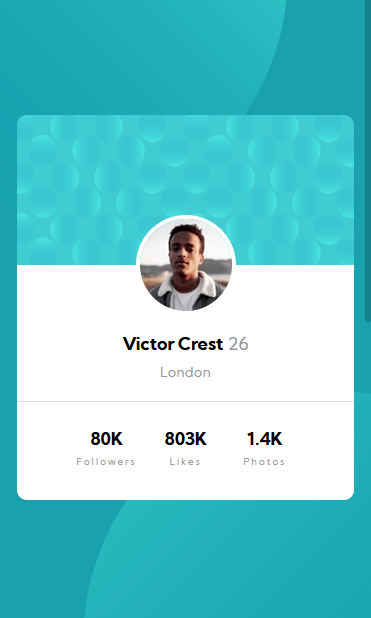

# Frontend Mentor - Profile card component solution

This is a solution to the [Profile card component challenge on Frontend Mentor](https://www.frontendmentor.io/challenges/profile-card-component-cfArpWshJ). Frontend Mentor challenges help you improve your coding skills by building realistic projects.

## Table of contents

- [The challenge](#the-challenge)
- [Screenshot](#screenshot)
- [Links](#links)
- [Built with](#built-with)
- [What I learned](#what-i-learned)
- [Useful resources](#useful-resources)
- [Author](#author)

### The challenge

- I found this challenge on Frontendmentor.io and give it a try to test my CSS skills.

### Screenshot




### Links

- Solution URL: [Github](https://github.com/Pranto-Bapary/profile-card-component)
- Live Site URL: [Github Pages](https://pranto-bapary.github.io/profile-card-component)

### Built with

- Semantic HTML5 markup
- CSS custom properties
- Flexbox
- CSS Grid
- Mobile-first workflow

### What I learned

By creating this project I've learned to use flexbox and grid properly and also learned how to position a element in the proper way.

To see how you can add code snippets, see below:

```html
<h1>Some HTML code I'm proud of</h1>
```

```css
.proud-of-this-css {
  color: papayawhip;
}
```

```js
const proudOfThisFunc = () => {
  console.log("Hello World");
};
```

### Useful resources

- [W3schools](https://www.w3schools.com) - This helped me for understanding overflow property for this project. I really liked the way they provide the content.

## Author

- Website - [Pranto Bapary](https://www.pranto-bapary.github.io/portfolio)
- Frontend Mentor - [@pranto-bapary](https://www.frontendmentor.io/profile/Pranto-Bapary)
- Facebook - [@ashfe.pranto](https://www.facebook.com/ashfe.pranto)
